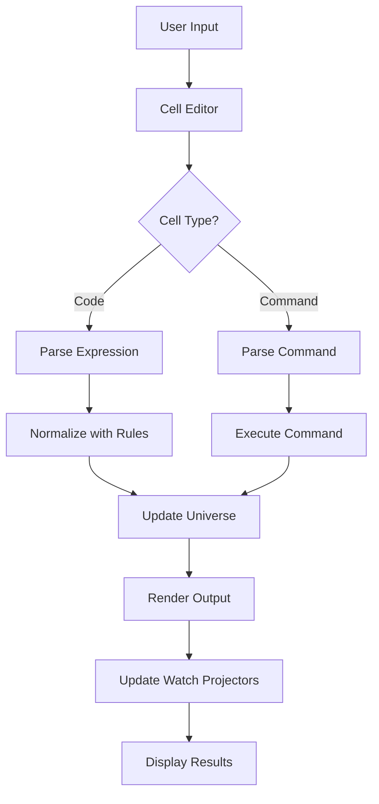

# The Syma Notebook Documentation
## Interactive Literate Programming with Symbolic Computation

The Syma Notebook is a browser-based interactive computing environment inspired by Jupyter, designed specifically for symbolic programming with Syma. It combines code execution, rich documentation, interactive UI rendering, and live reactive programming in a single interface.

---

## Table of Contents

1. [Introduction](#1-introduction)
2. [Getting Started](#2-getting-started)
3. [Cell System](#3-cell-system)
4. [Module System in Notebooks](#4-module-system-in-notebooks)
5. [Interactive UI Rendering](#5-interactive-ui-rendering)
6. [Watch Mode and Reactive Programming](#6-watch-mode-and-reactive-programming)
7. [Standard Library Integration](#7-standard-library-integration)
8. [Command Reference](#8-command-reference)
9. [Keyboard Shortcuts](#9-keyboard-shortcuts)
10. [Import/Export Formats](#10-importexport-formats)
11. [Architecture Overview](#11-architecture-overview)
12. [Best Practices](#12-best-practices)
13. [Comparison with REPL](#13-comparison-with-repl)
14. [Examples and Patterns](#14-examples-and-patterns)

---

## 1. Introduction

### What is the Syma Notebook?

The Syma Notebook is a web-based interactive environment that brings the power of literate programming to symbolic computation. Unlike traditional REPLs that process commands linearly, the notebook provides:

- **Cell-based execution**: Organize code and documentation in reusable cells
- **Rich output**: Render interactive UI components alongside symbolic results
- **Persistent state**: All cells share a global universe that persists across executions
- **Live reactivity**: Multiple UI cells can watch and respond to state changes
- **Module development**: Define and test modules directly in the notebook
- **Documentation integration**: Mix markdown documentation with executable code

### Key Differentiators

| Feature | REPL | Notebook |
|---------|------|----------|
| **Interface** | Command line | Web browser with rich UI |
| **Organization** | Sequential history | Reorderable cells |
| **Documentation** | Comments only | Full markdown with LaTeX |
| **UI Rendering** | Text output | Interactive DOM components |
| **State Management** | Single universe | Shared universe with watch mode |
| **Module Development** | File-based | In-notebook definitions |
| **Persistence** | Manual save/load | Auto-save to localStorage |
| **Collaboration** | Export/import | Shareable .symnb files |

### Philosophy

The notebook embodies three core principles:

1. **Literate Programming**: Code and documentation are equally important
2. **Interactive Exploration**: See results immediately, iterate quickly
3. **Reactive Composition**: Build complex UIs from simple, reactive components

---

## 2. Getting Started

### Accessing the Notebook

```bash
# Start the development server
npm run dev

# Navigate to the notebook interface
# http://localhost:5173/notebook
```

The notebook runs entirely in the browser—no server-side kernel required. All computation happens client-side using the Syma runtime compiled to JavaScript.

### First Notebook

When you open the notebook for the first time, you'll see example cells demonstrating key features:

```markdown
# Cell 1: Markdown
# Syma Notebook
Welcome to the interactive notebook...
```

```lisp
; Cell 2: Code
{Add 1 2}
→ 3
```

```lisp
; Cell 3: Multiline rule
:rule multiline
Counter
  Apply(Inc, State({Count n_}))
  ->
  State({Count Add(n_, 1)})
:end
```

```lisp
; Cell 4: Interactive UI
:render multiline
{Div
  :class "card"
  {H1 "Interactive Counter"}
  {P "Count: " {Show Count}}
  {Button :onClick Inc "Click Me!"}
}
:end
```

### Interface Overview

The notebook interface consists of:

- **Toolbar**: File operations, run controls, kernel status
- **Cell List**: Sequence of code and markdown cells
- **Cell Editor**: Monaco editor for code, markdown renderer/editor
- **Output Area**: Results, errors, and rendered UI components
- **Cell Controls**: Run, add, delete, move, change type

---

## 3. Cell System

### Cell Types

#### Code Cells

Execute Syma expressions and commands:

```lisp
; Expressions are evaluated and normalized
{Mul 3 {Add 2 2}}
→ 12

; Commands modify the universe
:rule Double {Double n_} → {Mul n_ 2}

; Multiple expressions/commands per cell
{Double 5}
→ 10
:rules
→ Rules (1): Double
```

#### Markdown Cells

Document your work with rich formatting:

- **Headers**: `# Title`, `## Section`
- **Emphasis**: `*italic*`, `**bold**`
- **Lists**: Ordered and unordered
- **Code**: Inline `` `code` `` and blocks
- **Math**: LaTeX expressions with `$...$` and `$$...$$`
- **Links**: `[text](url)`
- **Tables**: GitHub-flavored markdown

### Cell Execution

#### Individual Execution

- **Run Cell**: `Shift+Enter` - Execute and move to next
- **Run in Place**: `Ctrl+Enter` - Execute and stay

#### Batch Execution

- **Run All**: Execute all cells in order
- **Run Above**: Execute all cells above current
- **Run Below**: Execute all cells below current

#### Execution Model

1. Cells share a global universe (program state + rules)
2. Each execution can modify the universe
3. Changes persist across cell executions
4. Output appears below each cell
5. Errors don't stop subsequent cells

### Cell Management

#### Adding Cells

- **Above**: Press `a` when cell is selected (not editing)
- **Below**: Press `b` when cell is selected
- **UI Button**: Click `+` button in cell divider
- **Toolbar**: Use "Add Cell" dropdown

#### Cell Operations

- **Move Up/Down**: Drag handle or use toolbar buttons
- **Delete**: `d` twice when selected (not editing)
- **Change Type**: `m` for markdown, `y` for code
- **Copy/Cut/Paste**: Standard keyboard shortcuts in editor
- **Clear Output**: Toolbar button or cell menu

### Output Types

Notebooks support multiple output types:

1. **Text**: Plain text results
2. **Results**: Pretty-printed symbolic expressions
3. **Errors**: Stack traces with highlighting
4. **DOM**: Interactive UI components
5. **Volatile DOM**: UI that updates with state changes

---

## 4. Module System in Notebooks

### Defining Modules

Create modules directly in notebook cells:

```lisp
:module multiline
{Module MyUtils
  {Export Double Triple Format}

  {Defs
    {Double {Mul 2}}
    {Triple {Mul 3}}}

  {Rules
    {R "Format/Number"
      {Format n_}
      {Concat "Number: " {ToString n_}}
      500}}}
:end
```

### Module Features in Notebooks

Notebook modules support all standard module features:

- **Exports**: Public interface declaration
- **Imports**: Dependencies on other modules
- **Defs**: Named constants and functions
- **Rules**: Pattern-based transformations
- **RuleRules**: Meta-rules for syntax extensions

### Importing Modules

#### Notebook Modules

```lisp
; Import a module defined in the notebook
:import MyUtils

; With modifiers
:import MyUtils open        ; Unqualified symbols
:import MyUtils macro       ; Apply RuleRules
:import MyUtils open macro  ; Both
```

#### Standard Library Modules

```lisp
; Import from stdlib
:import Core/List
:import Core/String open
:import Core/Fun macro
```

### Module Workflow

1. **Define** module in a cell
2. **Import** in another cell
3. **Use** exported symbols
4. **Iterate** by re-running definition cell
5. **Export** to file when ready

### Module Persistence

- Notebook modules exist only in memory
- Saved with notebook in `.symnb` files
- Can export to `.syma` files for use elsewhere
- Automatically reloaded when notebook reopens

---

## 5. Interactive UI Rendering

### The :render Command

Create interactive UI components that manipulate global state:

```lisp
:render {Button :onClick Inc "Increment"}
```

### Multiline UI Definitions

For complex UIs, use multiline syntax:

```lisp
:render multiline
{Div :class "container"
  {H1 "Todo List"}
  {Input
    :type "text"
    :value {Input todoInput}
    :placeholder "Enter task"
    :onKeydown {When {KeyIs "Enter"}
      {Seq
        {AddTodo {Input todoInput}}
        {ClearInput todoInput}}}}
  {Ul
    {Map todos {Lambda t
      {Li
        {Checkbox :checked {Get t done}}
        {Span {Get t text}}}}}}}
:end
```

### UI State Management

The `:render` command:

1. Creates a temporary universe with your UI
2. Keeps the current program state
3. Dispatches actions to the global universe
4. Updates all watching components

### Supported UI Elements

All standard HTML elements as symbolic expressions:

- **Layout**: `Div`, `Span`, `Section`, `Article`
- **Text**: `H1`-`H6`, `P`, `Pre`, `Code`
- **Lists**: `Ul`, `Ol`, `Li`
- **Forms**: `Input`, `Button`, `Select`, `Textarea`
- **Media**: `Img`, `Video`, `Audio`, `Canvas`
- **Semantic**: `Nav`, `Header`, `Footer`, `Main`

### Event Handlers

Attach symbolic actions to events:

```lisp
{Button
  :onClick {Apply Inc state}           ; Simple action
  :onMouseover {SetHover True}         ; Hover effects
  :onKeydown {When {KeyIs "Enter"} Submit}  ; Conditional
  :onSubmit {PreventDefault SaveForm}  ; Form handling
}
```

### Dynamic Content

Use `Show` and `Project` for reactive content:

```lisp
{Div
  "Count: " {Show Count}           ; Display state value
  {Project {ComputeTotal items}}   ; Computed values
  {If {Gt Count 10}
    {Span "High!"}
    {Span "Low"}}}                 ; Conditional rendering
```

---

## 6. Watch Mode and Reactive Programming

### Watch Mode Basics

Watch mode enables multiple UI cells to stay synchronized:

```lisp
; Cell 1: Counter display (watching)
:render watch {Div "Count: " {Show Count}}

; Cell 2: Increment button (watching)
:render watch {Button :onClick Inc "+"}

; Cell 3: Decrement button (watching)
:render watch {Button :onClick Dec "-"}

; When any cell updates state, ALL watching cells re-render
```

### How Watch Mode Works

1. **Registration**: Watch cells register with the notebook engine
2. **State Changes**: Actions modify the global universe
3. **Broadcast**: Engine notifies all watch projectors
4. **Re-render**: Each watch cell updates its display
5. **Consistency**: All cells show the same state

### Watch Patterns

#### Coordinated UI Components

```lisp
; Cell 1: Input field (watching)
:render watch multiline
{Input
  :type "text"
  :value {Show SearchTerm}
  :onChange {UpdateSearch}}
:end

; Cell 2: Results display (watching)
:render watch multiline
{Div
  {Map {Filter items {MatchesSearch}} RenderItem}}
:end
```

#### Dashboard Pattern

```lisp
; Cell 1: Controls (watching)
:render watch {ControlPanel}

; Cell 2: Visualization (watching)
:render watch {DataChart}

; Cell 3: Summary stats (watching)
:render watch {StatsPanel}
```

### Universe Watch Mode

Watch the entire universe UI:

```lisp
:render-universe watch
```

This renders the Program's UI section and keeps it synchronized with state changes from any other cell.

### Performance Considerations

- Watch cells only update when state actually changes
- Each cell maintains its own virtual DOM
- Updates are batched for efficiency
- Clean up watch projectors when cells are deleted

---

## 7. Standard Library Integration

### Pre-loaded Modules

Core/Syntax/Global is automatically imported for all notebooks:

```lisp
; These syntactic sugars are available immediately:
:rule name pattern -> replacement
:fn Double x -> {Mul x 2}
```

### Available Stdlib Modules

The notebook can import any stdlib module:

```lisp
; Data structures
:import Core/List
:import Core/Set
:import Core/Map

; String manipulation
:import Core/String
:import Core/String/Regex

; Functional programming
:import Core/Fun
:import Core/Monad

; UI utilities
:import UI/Components
:import UI/Forms
```

### Module Discovery

View available modules:

```lisp
:import
→ Shows list of notebook and stdlib modules

; Or programmatically
:rules
→ Shows imported rules
```

### Module Compilation

Notebook imports pre-compiled stdlib modules:

1. Modules are compiled at build time
2. Stored as JSON in `/stdlib/`
3. Indexed for fast lookup
4. Loaded on-demand
5. Cached in memory

---

## 8. Command Reference

### Module Commands

| Command | Description | Example |
|---------|-------------|---------|
| `:module multiline` | Define a module | `:module multiline ... :end` |
| `:import <module> [open] [macro]` | Import a module | `:import Core/List open` |

### Rendering Commands

| Command | Description | Example |
|---------|-------------|---------|
| `:render <node>` | Render UI element | `:render {Button "Click"}` |
| `:render watch <node>` | Render with live updates | `:render watch {Show Count}` |
| `:render multiline` | Multiline UI definition | `:render multiline ... :end` |
| `:render-universe [watch]` | Render universe UI | `:render-universe watch` |

### File Operations

| Command | Description | Example |
|---------|-------------|---------|
| `:save [filename]` | Download universe | `:save myapp.json` |
| `:load` | Load universe from file | `:load` (opens picker) |

### Universe Management

| Command | Description | Example |
|---------|-------------|---------|
| `:universe` | Show current universe | `:universe` |
| `:rules` | List all rules | `:rules` |
| `:clear` | Reset universe | `:clear` |

### Rule Commands

| Command | Description | Example |
|---------|-------------|---------|
| `:rule multiline` | Define multiline rule | `:rule multiline ... :end` |
| `:rule <name> <pattern> → <repl>` | Inline rule | `:rule Inc n_ → Add(n_, 1)` |

### Help

| Command | Description |
|---------|-------------|
| `:help` | Show command help |

---

## 9. Keyboard Shortcuts

### Global Shortcuts

| Shortcut | Action |
|----------|--------|
| `Ctrl/Cmd + S` | Save notebook |
| `Ctrl/Cmd + O` | Open notebook |
| `Ctrl/Cmd + Shift + P` | Command palette (future) |

### Cell Navigation (when not editing)

| Shortcut | Action |
|----------|--------|
| `↑` / `k` | Select cell above |
| `↓` / `j` | Select cell below |
| `Enter` | Enter edit mode |
| `Escape` | Exit edit mode |

### Cell Operations (when selected, not editing)

| Shortcut | Action |
|----------|--------|
| `a` | Add cell above |
| `b` | Add cell below |
| `d d` | Delete cell (press twice) |
| `m` | Convert to markdown |
| `y` | Convert to code |
| `x` | Cut cell |
| `c` | Copy cell |
| `v` | Paste cell below |
| `Shift + M` | Merge with cell below |

### Execution

| Shortcut | Action |
|----------|--------|
| `Shift + Enter` | Run cell and select below |
| `Ctrl/Cmd + Enter` | Run cell in place |
| `Alt + Enter` | Run cell and add below |
| `Ctrl/Cmd + Shift + Enter` | Run all cells |

### Editor Shortcuts (when editing)

Standard Monaco/VS Code shortcuts apply:

| Shortcut | Action |
|----------|--------|
| `Ctrl/Cmd + Z` | Undo |
| `Ctrl/Cmd + Y` | Redo |
| `Ctrl/Cmd + F` | Find |
| `Ctrl/Cmd + H` | Replace |
| `Ctrl/Cmd + /` | Toggle comment |
| `Tab` | Indent |
| `Shift + Tab` | Dedent |

---

## 10. Import/Export Formats

### Notebook Format (.symnb)

Native JSON format preserving all cell metadata:

```json
{
  "metadata": {
    "name": "MyNotebook",
    "created": "2024-01-01T00:00:00Z",
    "modified": "2024-01-02T00:00:00Z",
    "kernelName": "syma",
    "languageInfo": {
      "name": "syma",
      "version": "1.0.0",
      "fileExtension": ".syma",
      "mimeType": "text/x-syma"
    }
  },
  "cells": [
    {
      "id": "cell-1",
      "type": "code",
      "content": "{Add 1 2}",
      "outputs": [{"type": "result", "content": "3"}],
      "executionCount": 1,
      "metadata": {}
    },
    {
      "id": "cell-2",
      "type": "markdown",
      "content": "# Documentation",
      "outputs": [],
      "metadata": {}
    }
  ]
}
```

### Syma Export (.syma)

Export to executable Syma file:

```lisp
; Syma Notebook Export
; Generated: 2024-01-01T00:00:00Z
; Name: MyNotebook

;; Cell 1 (Code)
{Add 1 2}

;; Cell 2 (Markdown)
; # Documentation
; This is markdown content converted to comments
```

### Universe Export

Save compiled universe:

- `.json` - JSON AST format
- `.syma` - S-expression format

### Import Support

- `.symnb` - Full notebook with metadata
- `.syma` - Convert to notebook cells
- `.json` - Load as universe

---

## 11. Architecture Overview

### Component Structure

```
notebook/
├── notebook-engine.js       # Core execution engine
├── notebook-commands.js     # Command processor
├── notebook-store.js        # Zustand state management
├── notebook-io.js          # Import/export functionality
├── notebook-module-platform.js  # Module system integration
└── components/
    ├── Notebook.jsx        # Main notebook component
    ├── CodeCell.jsx        # Code cell with Monaco editor
    ├── MarkdownCell.jsx    # Markdown cell with preview
    ├── CellDivider.jsx     # Cell separator with controls
    └── NotebookToolbar.jsx # Top toolbar
```

### Execution Flow



### State Management

The notebook uses Zustand for state management:

1. **Cell State**: Content, outputs, execution status
2. **Notebook Metadata**: Name, timestamps, kernel info
3. **Execution State**: Current cell, execution count
4. **Persistent Storage**: localStorage with auto-save

### Platform Integration

The notebook runs on a browser-specific platform:

```javascript
class NotebookPlatform {
  print(output)        // Route to cell output
  readFile(path)      // Fetch from server
  storage            // Use localStorage
  setTimeout()       // Browser timers
}
```

### Module Compilation

Notebook modules are compiled on-demand:

1. Parse module definition
2. Extract imports/exports
3. Resolve dependencies
4. Qualify symbols
5. Apply RuleRules
6. Merge into universe

---

## 12. Best Practices

### Organization

#### Logical Flow

Structure notebooks with clear sections:

```markdown
# Title and Overview
## Setup and Imports
## Data Definitions
## Core Logic
## Examples and Tests
## Interactive Demos
```

#### Cell Granularity

- One concept per cell
- Separate setup from execution
- Keep cells focused and reusable
- Document complex cells

### Development Workflow

#### Iterative Development

1. Start with simple expressions
2. Build up rules incrementally
3. Test each rule in isolation
4. Combine into modules
5. Create interactive demos

#### Testing Pattern

```lisp
; Cell 1: Define rule
:rule Factorial 0 → 1
:rule Factorial n_ → {Mul n_ {Factorial {Sub n_ 1}}}

; Cell 2: Test cases
{Factorial 0}  ; → 1
{Factorial 5}  ; → 120
{Factorial 10} ; → 3628800

; Cell 3: Edge cases
{Factorial -1} ; Should handle gracefully
```

### Performance

#### Avoid Infinite Loops

Add termination conditions to recursive rules:

```lisp
:rule Count n_ → {Count {Add n_ 1}} when {Lt n_ 100}
:rule Count n_ → {Done n_} when {Gte n_ 100}
```

#### Manage Watch Cells

- Limit number of watch cells
- Clear outputs periodically
- Use focused rendering
- Clean up when done

#### Optimize Rules

```lisp
; Bad: Multiple similar rules
:rule Add0Left {Add 0 n_} → n_
:rule Add0Right {Add n_ 0} → n_

; Good: Single rule with pattern
:rule AddZero {Add 0 n_} → n_ [priority: 10]
```

### Documentation

#### Inline Documentation

```lisp
; Cell explaining the algorithm
:markdown
## Fibonacci Sequence
Implements the recursive definition:
$$F(n) = F(n-1) + F(n-2)$$

; Cell with implementation
:rule Fib 0 → 0
:rule Fib 1 → 1
:rule Fib n_ → {Add {Fib {Sub n_ 1}} {Fib {Sub n_ 2}}}
```

#### Examples in Documentation

Use executable examples in markdown:

````markdown
## Usage

Run this code:
```syma
{Double 5}
```

Expected output: `10`
````

---

## 13. Comparison with REPL

### When to Use Notebook

Choose the notebook when you need:

- **Documentation**: Rich markdown with math and diagrams
- **Visualization**: Interactive UI components
- **Exploration**: Non-linear execution and experimentation
- **Sharing**: Self-contained documents with code and results
- **Teaching**: Step-by-step tutorials with explanations

### When to Use REPL

Choose the REPL when you need:

- **Quick Testing**: Fast command-line interaction
- **Debugging**: Step-by-step tracing
- **Automation**: Script integration
- **Resource Constraints**: Minimal memory usage
- **Terminal Work**: SSH or headless environments

### Feature Comparison

| Feature | REPL | Notebook |
|---------|------|----------|
| **Execution Model** | Sequential | Random access |
| **State Persistence** | Per session | Auto-save |
| **Output Format** | Text only | Rich media |
| **Code Organization** | History | Cells |
| **Module Development** | File-based | In-notebook |
| **UI Rendering** | Not supported | Full DOM |
| **Collaboration** | Copy/paste | Share files |
| **Learning Curve** | Lower | Higher |

---

## 14. Examples and Patterns

### Interactive Counter

Complete interactive counter with persistence:

```lisp
; Cell 1: Define state structure
:rule multiline
InitState
  {State {Count 0} {History []}}
:end

; Cell 2: Define actions
:rule multiline
Inc {Apply Inc {State {Count n_} hist_}}
  -> {State {Count {Add n_ 1}} {Append hist_ n_}}
:end

:rule multiline
Dec {Apply Dec {State {Count n_} hist_}}
  -> {State {Count {Sub n_ 1}} {Append hist_ n_}}
:end

; Cell 3: Render UI with watch
:render watch multiline
{Div :class "counter-app"
  {H2 "Interactive Counter"}
  {Div :class "display"
    {Span "Current: " {Show Count}}}
  {Div :class "controls"
    {Button :onClick Dec "-"}
    {Button :onClick Inc "+"}}
  {Div :class "history"
    {H3 "History"}
    {Ul {Map {Show History} {Lambda h {Li h}}}}}}
:end
```

### Data Transformation Pipeline

Process data through multiple stages:

```lisp
; Cell 1: Load data
:module multiline
{Module DataPipeline
  {Export Process Clean Transform}

  {Defs
    {RawData [{x 1 y 2} {x 3 y 4} {x 5 y 6}]}}

  {Rules
    ; Cleaning rules
    {R "Clean" {Clean data_} {Filter data_ Valid}}

    ; Transformation rules
    {R "Transform" {Transform data_} {Map data_ Normalize}}

    ; Full pipeline
    {R "Process" {Process} {Transform {Clean RawData}}}}}
:end

; Cell 2: Import and use
:import DataPipeline
{Process}
```

### Form Validation

Interactive form with validation:

```lisp
; Cell 1: Validation rules
:rule multiline
ValidateEmail email_ ->
  {If {Matches email_ "@"}
    {Valid email_}
    {Invalid "Must contain @"}}
:end

:rule multiline
ValidateForm {Form email_ password_} ->
  {And {ValidateEmail email_}
       {ValidatePassword password_}}
:end

; Cell 2: Render form with live validation
:render watch multiline
{Form
  {Input
    :type "email"
    :value {Show Email}
    :onChange {UpdateEmail}
    :class {If {ValidateEmail {Show Email}} "valid" "invalid"}}
  {Span :class "error" {ShowError Email}}

  {Input
    :type "password"
    :value {Show Password}
    :onChange {UpdatePassword}}

  {Button
    :type "submit"
    :disabled {Not {ValidateForm {Show FormData}}}
    "Submit"}}
:end
```

### Module Development Workflow

Build and test a module incrementally:

```lisp
; Cell 1: Start with basic structure
:module multiline
{Module MyLib
  {Export Feature1}
  {Rules
    {R "Feature1" {Feature1 x_} x_}}}
:end

; Cell 2: Test it
:import MyLib
{Feature1 "test"} ; → "test"

; Cell 3: Enhance the module
:module multiline
{Module MyLib
  {Export Feature1 Feature2}
  {Rules
    {R "Feature1" {Feature1 x_} {Process x_}}
    {R "Feature2" {Feature2 x_ y_} {Combine x_ y_}}
    {R "Process" {Process x_} {Upper x_}}
    {R "Combine" {Combine x_ y_} {Concat x_ " " y_}}}}
:end

; Cell 4: Test enhanced version
:import MyLib
{Feature1 "test"}      ; → "TEST"
{Feature2 "a" "b"}     ; → "a b"
```

---

## Conclusion

The Syma Notebook transforms symbolic programming from a command-line activity into an interactive, visual experience. By combining the power of symbolic computation with modern web technologies, it enables:

- **Rapid Prototyping**: Build and test ideas immediately
- **Interactive Documentation**: Explain code with rich media
- **Live Development**: See changes instantly across components
- **Collaborative Learning**: Share complete interactive documents

Whether you're learning Syma, developing applications, or exploring symbolic computation, the notebook provides a powerful environment for creative programming.

---

## Quick Reference Card

```
EXECUTION
  Shift+Enter         Run cell and advance
  Ctrl+Enter          Run cell in place

NAVIGATION (not editing)
  ↑/↓ or j/k         Move between cells
  Enter              Edit cell
  Escape             Exit edit mode

CELL OPERATIONS
  a                  Add cell above
  b                  Add cell below
  d d                Delete cell
  m                  Convert to markdown
  y                  Convert to code

COMMANDS
  :import <module>   Import module
  :render <ui>       Render UI element
  :render watch      Live-updating UI
  :module multiline  Define module
  :save              Download universe
  :load              Load universe
  :help              Show help

MULTILINE SYNTAX
  :command multiline
  ... content ...
  :end

WATCH MODE
  Prefix :render with 'watch' for reactive UI
  Multiple watch cells stay synchronized
```